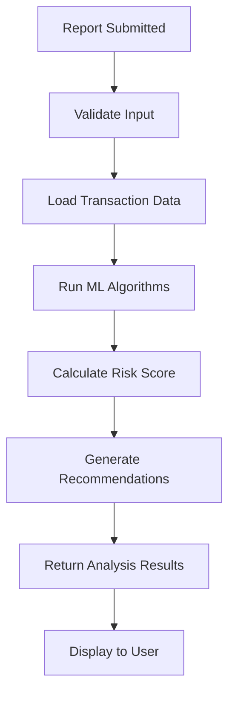

# ML Detection System Documentation

## Overview

The ML Detection System provides advanced behavioral pattern analysis for cryptocurrency wallets to identify potential fraud and malicious activities. The system analyzes transaction patterns, behavioral indicators, and historical data to generate risk scores and recommended actions.

## How It Works

### 1. Data Sources

The system analyzes multiple data sources:
- **BHX Transaction Data**: Historical transaction records from `bhx_transactions.json`
- **Wallet Address Patterns**: Address structure analysis for suspicious patterns
- **Report Reasons**: Natural language processing of user-reported reasons
- **Historical Reports**: Previous reports and flagging history

### 2. Detection Algorithms

#### A. Rapid Dumping Detection
```javascript
Threshold: 5+ transactions within 300 seconds (5 minutes)
Weight: 30% of total risk score
Logic:
- Sorts transactions chronologically
- Identifies sequences of rapid transactions
- Calculates frequency and intensity of dumping patterns
- Flags wallets with abnormal selling velocity
```

#### B. Large Transfer Analysis  
```javascript
Threshold: Transfers > 100 BHX tokens
Weight: 25% of total risk score
Logic:
- Identifies unusually large token movements
- Calculates average transfer amounts
- Compares against normal transaction patterns
- Flags potential market manipulation
```

#### C. Flash Loan Detection
```javascript
Time Window: Multiple transactions within 60 seconds
Weight: 20% of total risk score  
Logic:
- Detects MEV (Maximum Extractable Value) attacks
- Identifies arbitrage exploitation patterns
- Flags potential DeFi protocol manipulation
- Analyzes transaction timing correlations
```

#### D. Phishing Pattern Recognition
```javascript
Address Patterns: ['0x000', '0x111', '0x999']
Keywords: ['phish', 'scam', 'fake', 'impersonat', 'malicious', 'fraud']
Weight: 15% of total risk score
Logic:
- Scans wallet addresses for suspicious patterns
- NLP analysis of report reasons
- Cross-references known phishing indicators
- Identifies social engineering attempts
```

#### E. Historical Analysis
```javascript
Weight: 10% of total risk score
Logic:
- Queries previous reports for the wallet
- Analyzes report frequency and severity
- Identifies repeat offenders
- Tracks behavioral evolution over time
```

### 3. Risk Scoring Algorithm

The system uses a weighted scoring model:

```javascript
Risk Score = (
  rapidDumping * 0.30 +
  largeAmount * 0.25 + 
  flashLoan * 0.20 +
  phishingPattern * 0.15 +
  reportHistory * 0.10
)
```

#### Risk Categories:
- **🟢 Low (0.0 - 0.39)**: No action required
- **🟡 Medium (0.4 - 0.59)**: Monitor wallet activity  
- **🟠 High (0.6 - 0.79)**: Investigate further
- **🔴 Critical (0.8 - 1.0)**: Freeze wallet immediately

### 4. Recommended Actions

Based on risk scores, the system recommends:

| Risk Score | Action | Description |
|------------|--------|-------------|
| 0.8 - 1.0 | `freeze` | Immediate wallet suspension |
| 0.6 - 0.79 | `investigate` | Manual review required |
| 0.4 - 0.59 | `monitor` | Enhanced surveillance |
| 0.0 - 0.39 | `no_action` | Normal processing |

## Integration Workflow

### Frontend Integration

1. **User Input**: Wallet address and reason are mandatory
2. **Form Submission**: Report submitted via incident form
3. **Automatic Trigger**: ML analysis starts after successful submission
4. **Real-time Display**: Results appear immediately below submit button
5. **Visual Feedback**: Color-coded risk indicators and recommendations

### Backend Processing



### API Endpoints

#### Analyze Wallet
```http
POST /api/ml/analyze
Content-Type: application/json
Authorization: Bearer <token>

{
  "address": "0x1234567890abcdef...",
  "reason": "Suspicious trading patterns"
}
```

#### Get Configuration
```http
GET /api/ml/config
Authorization: Bearer <token>
```

## Analysis Output Format

```json
{
  "address": "0x1234567890abcdef...",
  "violation": "Rapid token dump, Large suspicious transfers",
  "score": 0.87,
  "recommended_action": "freeze",
  "analysis_details": {
    "rapid_dumping": {
      "detected": true,
      "score": 0.8,
      "sequences": 3,
      "max_sequence_length": 7
    },
    "large_transfers": {
      "detected": true,
      "score": 0.6,
      "count": 5,
      "average_amount": 150
    },
    "flash_loans": {
      "detected": false,
      "score": 0,
      "patterns": 0
    },
    "phishing_indicators": {
      "detected": true,
      "score": 0.4,
      "keyword_matches": ["scam", "fraud"]
    }
  },
  "transaction_count": 25,
  "analyzed_at": "2025-08-25T07:30:00.000Z"
}
```

## Database Integration

The system can be extended to store analysis results:

```javascript
// MongoDB Collection: ml_analyses
db.ml_analyses.insertOne({
  address: "0x1234567890abcdef...",
  violation: "Rapid token dump",
  score: 0.87,
  recommended_action: "freeze",
  analysis_details: { /* ... */ },
  analyzed_by: "user@example.com",
  analyzed_at: new Date(),
  status: "pending_review"
})
```

## Future Enhancements

### Machine Learning Integration
- **Anomaly Detection**: Unsupervised learning for pattern discovery
- **Behavioral Clustering**: Group similar wallet behaviors
- **Predictive Modeling**: Forecast potential fraud before it occurs
- **Feature Engineering**: Extract advanced transaction features

### Real-time Processing
- **Stream Processing**: Kafka integration for live analysis
- **Event-driven Architecture**: Real-time alerts and notifications
- **Continuous Learning**: Model updates based on new patterns

### Advanced Analytics
- **Graph Analysis**: Network analysis of connected wallets
- **Cross-chain Detection**: Multi-blockchain pattern recognition
- **Social Media Integration**: Sentiment analysis from social platforms
- **Regulatory Compliance**: Automatic compliance checking

## Security Considerations

- **Data Privacy**: All analysis respects user privacy
- **False Positive Handling**: Manual review process for high-stakes decisions  
- **Audit Trail**: Complete logging of all analysis decisions
- **Rate Limiting**: API protection against abuse
- **Access Control**: Role-based analysis permissions

## Performance Metrics

The system monitors:
- **Accuracy Rate**: Percentage of correct fraud detections
- **False Positive Rate**: Incorrectly flagged legitimate transactions
- **Processing Time**: Average analysis completion time
- **Coverage Rate**: Percentage of analyzed vs total transactions

---

*This ML detection system provides a robust foundation for cryptocurrency fraud detection while maintaining transparency and auditability in all decisions.*